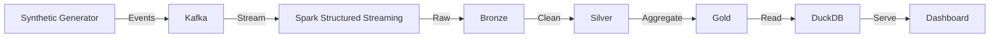

# Streaming Clickstream Pipeline

A production-quality, real-time streaming analytics pipeline for e-commerce clickstream data. Built with Apache Kafka, Spark Structured Streaming, Delta Lake, MinIO, DuckDB, and Streamlit.

## Architecture



## Quick Start

```bash
git clone <repo-url>
cd streaming-clickstream-pipeline

# Start all services
docker compose up -d

# Access the dashboard
open http://localhost:8501

# Access Kafka UI
open http://localhost:8080

# Access MinIO Console
open http://localhost:9001
```

## Folder Structure

```
streaming-clickstream-pipeline/
├── producer/         # Synthetic clickstream generator
│   ├── main.py       # Entry point
│   ├── generator.py  # Event generation logic
│   ├── models.py     # Data models
│   ├── config.py     # Configuration
│   └── kafka_client.py # Kafka producer
├── spark/            # Spark streaming pipeline
│   ├── main.py       # Entry point
│   ├── streaming.py  # Streaming pipeline
│   ├── schemas.py    # PySpark schemas
│   ├── transforms.py # Transform functions
│   └── config.py     # Configuration
├── dashboard/        # Streamlit dashboard
│   ├── app.py        # Main dashboard
│   ├── config.py     # Configuration
│   └── components/   # UI components
│       ├── overview.py
│       ├── traffic.py
│       ├── funnel.py
│       ├── geography.py
│       ├── products.py
│       └── infrastructure.py
├── storage/          # Data lake access layer
│   ├── config.py     # Configuration
│   └── queries.py    # DuckDB queries
├── docker/           # Dockerfiles
│   ├── producer/Dockerfile
│   ├── spark/Dockerfile
│   └── dashboard/Dockerfile
├── tests/            # Test suite
├── docs/             # Documentation
├── docker-compose.yml
├── Makefile
└── pyproject.toml
```

## Data Flow

1. **Synthetic Generator** produces realistic e-commerce clickstream events
2. **Kafka** ingests events with configurable partitioning and retention
3. **Spark Structured Streaming** consumes events with watermarking and event-time processing
4. **Bronze** layer stores raw data partitioned by year/month/day/hour
5. **Silver** layer cleans, validates, and enriches data
6. **Gold** layer computes funnel metrics, product performance, and traffic analytics
7. **DuckDB** serves as the analytics layer for dashboard queries
8. **Streamlit Dashboard** visualizes metrics in real-time with Plotly

## Event Schema

| Field | Type | Description |
|-------|------|-------------|
| event_id | string | Unique event identifier |
| event_time | string | ISO 8601 timestamp |
| user_id | string | Anonymous user identifier |
| session_id | string | Session identifier |
| event_type | string | One of 10 event types |
| page | string | Page URL path |
| product_id | string | Product identifier |
| category | string | Product category |
| device | string | mobile/desktop/tablet |
| browser | string | Browser name |
| operating_system | string | OS name |
| country | string | Country name |
| city | string | City name |
| traffic_source | string | Source of traffic |
| price | float | Product price |
| quantity | int | Item quantity |
| cart_value | float | Total cart value |
| currency | string | Currency code |
| experiment_group | string | A/B testing group |
| is_logged_in | boolean | Authentication status |

## Event Types

- page_view, search, category_view, product_view
- add_to_cart, remove_from_cart
- begin_checkout, payment, purchase, logout

## Key Features

### Synthetic Generator
- Realistic customer journeys with state-machine progression
- Configurable events/sec, user count, abandonment/conversion rates
- Burst mode, Black Friday simulation, random traffic spikes
- Session management with cart state tracking

### Kafka
- 6 partitions for parallel consumption
- Idempotent producer with exactly-once semantics
- Dead letter topic for malformed events
- Delivery callbacks and metrics reporting

### Spark Structured Streaming
- Event-time processing with watermarking
- 5-minute tumbling windows for aggregation
- Bronze/Silver/Gold medallion architecture
- Checkpointing for fault tolerance
- Schema validation and malformed event handling

### Delta Lake
- ACID transactions on data lake
- Partitioned by year/month/day/hour
- Schema evolution support
- Time travel capabilities

### Dashboard
- 6 panels: Overview, Traffic, Funnel, Geography, Products, Infrastructure
- Auto-refreshing with configurable interval
- Plotly interactive charts
- Responsive layout

## Testing

```bash
make test           # Run unit tests
make test-cov       # Run with coverage
make compose-smoke  # Run Docker smoke tests
```

## Code Quality

```bash
make lint           # Ruff linting
make format         # Auto-format code
make typecheck      # mypy type checking
```

## CI/CD

GitHub Actions automatically runs:
- Ruff linting
- Black formatting check
- isort import check
- mypy type checking
- Unit tests
- Docker build verification

## Services

| Service | Port | Description |
|---------|------|-------------|
| Dashboard | 8501 | Streamlit UI |
| Kafka UI | 8080 | Kafka management |
| MinIO API | 9000 | S3-compatible storage |
| MinIO Console | 9001 | Storage management |
| Kafka | 9092 | Message broker |
| Zookeeper | 2181 | Coordination |

## Configuration

Copy `.env.example` to `.env` and customize:

```bash
cp .env.example .env
```

Key configuration options:
- `EVENTS_PER_SECOND`: Generator throughput
- `NUM_USERS`: Active user pool size
- `ABANDONMENT_RATE`: Cart abandonment probability
- `CONVERSION_RATE`: Purchase conversion probability
- `SPARK_BATCH_DURATION`: Micro-batch interval (seconds)
- `DASHBOARD_REFRESH_INTERVAL`: UI refresh rate (seconds)
