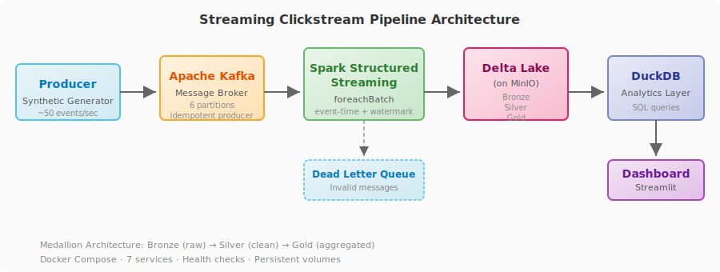

<div align="center">
  
</div>

<p align="center">
  
  
  
  
  
  
  
  
</p>

# Streaming Clickstream Pipeline

<p align="center">
  Real-time streaming analytics for e-commerce clickstream data —<br>
  Kafka → Spark Structured Streaming → Delta Lake → DuckDB → Streamlit
</p>

## Key Features

- **Event-driven ingestion** — ~50 events/sec from a synthetic generator into Kafka with idempotent exactly-once semantics
- **Stream processing** — Spark Structured Streaming with event-time processing, watermarking, and 10-second micro-batches
- **Medallion lakehouse** — Bronze (raw) → Silver (clean/enriched) → Gold (aggregated) on Delta Lake with ACID transactions
- **Real-time dashboard** — 6-page Streamlit dashboard with sparklines, conversion funnels, geographic heatmaps, and pipeline health monitoring
- **Dead-letter queue** — Invalid messages captured with failure metadata for offline reprocessing
- **Fault tolerance** — Checkpointing, graceful shutdown, consumer group rebalancing, and exactly-once semantics
- **Dockerized** — One command to start all 7 services with health checks and persistent volumes
- **CI/CD** — Automated linting, type checking, testing, and Docker build verification

## Business Problem

E-commerce platforms generate a continuous stream of clickstream events: page views, searches, product interactions, cart actions, and purchases. To understand user behavior, conversion funnels, and product performance in real time, these events must be ingested, processed, and analyzed with minimal latency.

This pipeline solves that problem by:

- Ingesting ~50 events/second from a synthetic clickstream generator into Kafka
- Processing with Spark Structured Streaming at 10-second micro-batch intervals
- Persisting as a Delta Lake medallion (Bronze → Silver → Gold) on MinIO
- Serving live analytics via DuckDB and a Streamlit dashboard

## Why These Technologies?

| Technology | Rationale |
|---|---|
| **Apache Kafka** | Industry standard for event streaming; provides durable, partitioned, replayable event log with exactly-once semantics |
| **Spark Structured Streaming** | Mature stream processing engine with event-time processing, watermarking, and exactly-once guarantees; same API as batch Spark |
| **Delta Lake** | ACID transactions, schema evolution, and time travel on data lake storage; eliminates need for a separate warehouse |
| **MinIO** | S3-compatible object storage for local development; drop-in replacement for AWS S3 in production |
| **DuckDB** | Embedded OLAP database optimized for analytical queries; zero-config, reads Delta/Parquet directly |
| **Streamlit** | Python-native dashboard framework; rapid iteration for data apps |

## Architecture

### Medallion Layers

| Layer | Description | Transformations |
|---|---|---|
| **Bronze** | Raw events with ingestion metadata | JSON parsing, schema enforcement, partition columns |
| **Silver** | Cleaned, validated, deduplicated events | Time range filtering, validation, enrichment, deduplication, session flags |
| **Gold** | Aggregated business metrics | Funnel conversion, product performance, traffic analytics |

### Data Flow

```
Synthetic Generator ──▶ Kafka ──▶ Spark Streaming ──▶ Delta Lake ──▶ DuckDB ──▶ Dashboard
                              │                         │
                              ▼                         ▼
                         Dead Letter               Bronze → Silver → Gold
                         (invalid events)           (medallion layers)
```

### Streaming Guarantees

- **At-least-once**: Delta Lake writes + checkpointing prevent data loss on restart
- **Effectively exactly-once**: `foreachBatch` with idempotent Delta writes + Kafka offset tracking
- **Out-of-order handling**: 10-minute watermark delay for late-arriving events; 7-day range filter drops stale data
- **Fault tolerance**: Consumer group rebalancing on restart; spark.sql.adaptive disabled in streaming (benign warning)
- **Dead letter queue**: Unparseable Kafka messages preserved with failure metadata for offline reprocessing

### Trade-offs

| Decision | Trade-off |
|---|---|
| Single `foreachBatch` query for all 3 layers | Simpler checkpoint management, but all layers share the same processing cadence |
| Delta Lake over raw Parquet | Schema evolution and ACID transactions at the cost of metadata overhead |
| DuckDB over full warehouse | Zero-config and lightweight, but no multi-user concurrency or role-based access |
| MinIO over cloud S3 | Reproducible local development; API-compatible, one config change to switch to AWS/GCP |

## Services

| Service | Port | Health Check | Purpose |
|---|---|---|---|
| Dashboard | 8501 | HTTP 200 | Streamlit real-time analytics |
| Kafka UI | 8080 | `/actuator/health` | Kafka cluster management |
| MinIO API | 9000 | `/minio/health/live` | S3-compatible object storage |
| MinIO Console | 9001 | — | Storage management UI |
| Kafka | 9092 | `kafka-broker-api-versions` | Message broker (6 partitions) |
| Zookeeper | 2181 | `ruok` | Kafka coordination |
| Producer | — | Custom | Synthetic event generator (~50 ev/s) |
| Spark | 4040 | Custom | Streaming pipeline (Bronze/Silver/Gold) |

## Quick Start

```bash
git clone https://github.com/suryalionael/streaming-clickstream-pipeline.git
cd streaming-clickstream-pipeline

# Start all services
docker compose up -d

# Verify all containers are healthy
docker compose ps

# Access the dashboard
open http://localhost:8501

# Access Kafka UI
open http://localhost:8080

# Access MinIO Console (credentials: minioadmin/minioadmin)
open http://localhost:9001
```

## Event Schema

| Field | Type | Example |
|---|---|---|
| event_id | string | `a1b2c3d4-...` |
| event_time | string (ISO 8601) | `2026-07-05T06:27:18.123456Z` |
| user_id | string | `user_000042` |
| session_id | string | `sess_3_a1b2c3d4` |
| event_type | enum | `page_view`, `search`, `product_view`, `add_to_cart`, `purchase`, ... |
| page | string | `/products`, `/cart`, `/checkout` |
| product_id | string (nullable) | `prod_042` |
| category | string (nullable) | `electronics`, `clothing` |
| device | string | `mobile`, `desktop`, `tablet` |
| browser | string | `Chrome`, `Safari`, `Firefox` |
| country | string | `United States`, `Germany` |
| traffic_source | string | `direct`, `organic_search`, `social_media` |
| price | float | `99.99` |
| quantity | int | `2` |
| cart_value | float | `199.98` |
| experiment_group | string | `control`, `variant_a` |

## Event Types

```
page_view → search → category_view → product_view → add_to_cart
→ remove_from_cart → begin_checkout → payment → purchase → logout
```

The synthetic generator simulates realistic customer journeys using a state machine: users browse, search, view products, add to cart, proceed through checkout, and purchase. Abandonment and conversion rates are configurable.

## Observability

The **Pipeline Health** page in the dashboard provides live operational metrics:

| Metric | Source | Indicator |
|---|---|---|
| Bronze / Silver / Gold row counts | DuckDB views over Delta tables | 🟢 > 0 rows, 🟡 0 rows |
| Latest event timestamp per layer | `MAX(event_time)` query | 🟢 < 5 min old, 🟡 5–15 min, 🔴 > 15 min |
| Events per second | `funnel_metrics` aggregate | 🟢 ≥ 1.0 eps, 🟡 < 1.0, 🔴 0 |
| Dead-letter event count | Dead-letter Delta table | 🟢 0 (no failures) |
| Kafka UI connectivity | HTTP `/actuator/health` | 🟢 HTTP 200, 🔴 unreachable |
| MinIO connectivity | HTTP `/minio/health/live` | 🟢 HTTP 200, 🔴 unreachable |
| DuckDB connection | Internal connection check | 🟢 connected, 🔴 disconnected |

All metrics auto-refresh on the same interval as the dashboard.

## Project Structure

```
streaming-clickstream-pipeline/
├── producer/           # Synthetic clickstream generator
│   ├── main.py         # Entry point with graceful shutdown
│   ├── generator.py    # State-machine event generation
│   ├── models.py       # ClickstreamEvent dataclass + validation
│   ├── kafka_client.py # Thread-safe Kafka producer
│   └── config.py       # Configuration
├── spark/              # Spark streaming pipeline
│   ├── streaming.py    # foreachBatch pipeline (Bronze/Silver/Gold/dead-letter)
│   ├── schemas.py      # PySpark schemas for all layers
│   ├── transforms.py   # Transform functions (validation, enrichment, aggregation)
│   └── config.py       # Spark configuration
├── dashboard/          # Streamlit dashboard
│   ├── app.py          # Main dashboard with 6 pages
│   ├── config.py       # Dashboard configuration
│   └── components/     # UI components
│       ├── overview.py     # KPI cards, sparklines, pipeline status
│       ├── traffic.py      # Time-series traffic charts
│       ├── funnel.py       # Conversion funnel visualization
│       ├── geography.py    # Geographic distribution
│       ├── products.py     # Product performance table
│       └── infrastructure.py # Pipeline observability & health
├── storage/            # Data lake access layer
│   ├── config.py       # Storage configuration
│   └── queries.py      # DuckDB queries for dashboard
├── docker/             # Container definitions
│   ├── producer/Dockerfile
│   ├── spark/Dockerfile
│   └── dashboard/Dockerfile
├── tests/              # Test suite (74 tests)
├── docs/               # Documentation
├── docker-compose.yml  # 7-service orchestration
├── Makefile            # Development commands
└── pyproject.toml      # Project configuration
```

## Testing

```bash
# Unit and edge-case tests
make test

# With coverage report
make test-cov

# Docker smoke tests (requires running containers)
make compose-smoke
```

**Test Coverage**: 74 tests across unit, edge case, Spark integration, and Docker smoke suites.

| Suite | Tests | Scope |
|---|---|---|
| Unit | 44 | State machine, event validation, JSON serialization |
| Edge case | 18 | Malformed JSON, nulls, duplicates, empty batches, late data, schema evolution |
| Spark integration | 6 | Silver/Gold transforms with SparkSession |
| Docker smoke | 6 | Service health, end-to-end pipeline |

## Code Quality

```bash
make lint      # Ruff — 0 errors
make format    # Black + isort — auto-format
make typecheck # mypy — strict mode, 0 errors
```

## CI/CD

GitHub Actions automatically runs on every push:

- Ruff linting
- Black formatting check
- isort import check
- mypy strict type checking
- Unit tests (44 + 18)
- Docker build verification

## Configuration

Copy `.env.example` to `.env` and customize:

```bash
cp .env.example .env
```

Key configuration options:

| Variable | Default | Description |
|---|---|---|
| `EVENTS_PER_SECOND` | 50 | Generator throughput |
| `NUM_USERS` | 1000 | Active user pool size |
| `ABANDONMENT_RATE` | 0.7 | Cart abandonment probability |
| `CONVERSION_RATE` | 0.05 | Purchase conversion probability |
| `SPARK_BATCH_DURATION` | 10 | Micro-batch interval (seconds) |
| `SPARK_WATERMARK_DELAY_MINUTES` | 60 | Late-arriving event tolerance |
| `DASHBOARD_REFRESH_INTERVAL` | 5 | UI refresh rate (seconds) |

## Future Enhancements

- Authentication and TLS for all services
- Kubernetes deployment with resource limits
- Prometheus metrics and Grafana dashboards
- Delta Lake maintenance jobs (VACUUM, OPTIMIZE)
- Schema registry integration
- Rate limiting with backpressure
- End-to-end data quality monitoring (row count SLAs, schema drift detection)

## License

MIT
