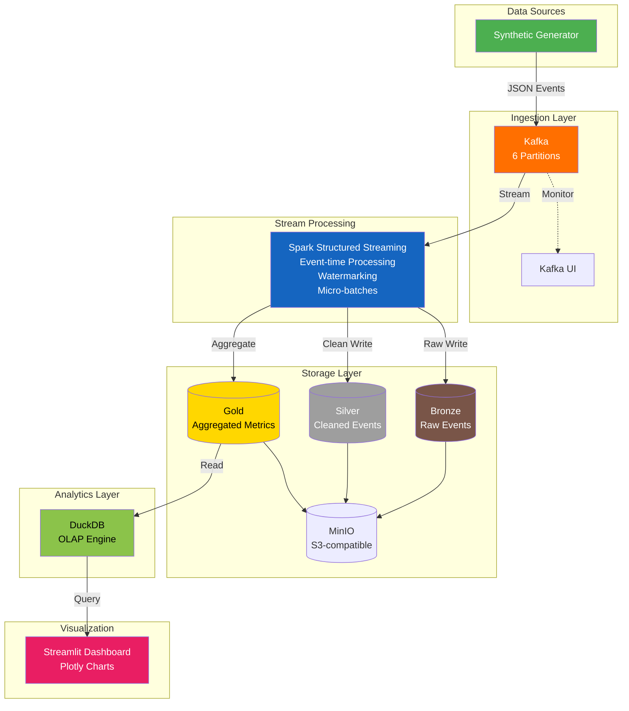

# Architecture Documentation

## System Architecture

The streaming clickstream pipeline implements a modern data architecture using the Lambda architecture pattern, combining real-time streaming with batch processing capabilities.

### High-Level Architecture

## Technology Choices

### Kafka vs Alternatives (RabbitMQ, Pulsar)

**Kafka** was chosen because:
- **High throughput**: Handles millions of events/sec with minimal overhead
- **Durability**: Persistent logs with configurable retention
- **Replayability**: Consumers can rewind and reprocess from any offset
- **Ecosystem**: Native Spark integration via `spark-sql-kafka`
- **Partitioning**: Natural parallelism model matching Spark partitioning

**Alternatives considered:**
- **RabbitMQ**: Better for task queues but lacks log-based storage for replay
- **Pulsar**: More features (geo-replication, tiered storage) but higher operational complexity

### Spark vs Flink

**Spark Structured Streaming** was chosen because:
- **Python-first**: Native PySpark support vs Flink's Java/Scala focus
- **Ecosystem**: Delta Lake, MLlib, and broader Spark ecosystem integration
- **Batch/Streaming Unification**: Same APIs for batch and streaming
- **Exactly-once semantics**: Built-in through Kafka transactions
- **Familiarity**: Wider talent pool and community adoption

**Flink** would be better for:
- Lower latency requirements (sub-second vs micro-batch)
- Complex event processing (CEP patterns)
- Stateful computations with larger state

### Delta Lake vs Parquet

**Delta Lake** was chosen because:
- **ACID transactions**: Concurrent reads/writes with serializable isolation
- **Schema evolution**: Handles schema changes without rewriting data
- **Time travel**: Query historical data snapshots
- **Compaction**: Optimizes small file problem through OPTIMIZE
- **Spark integration**: Native Spark connector

**Parquet alone** lacks:
- ACID transactions
- Schema enforcement
- Time travel capabilities
- Concurrent write support

### Streaming vs Batch

**Streaming** was chosen for the primary pipeline because:
- Real-time dashboard requires sub-minute latency
- Continuous processing matches the event-driven nature
- Automatic handling of late data through watermarking
- Eliminates batch scheduling complexity

**Batch processing** is preserved through:
- Delta Lake enables batch reprocessing when needed
- Historical analysis can use same data without re-streaming

## Partitioning Strategy

Data is partitioned by `year/month/day/hour`:
- **Hourly partitioning**: Balances query performance with partition management
- **Pruning**: Dashboard queries naturally filter by time range
- **Retention**: Easy to drop old partitions (e.g., `ALTER TABLE DROP PARTITION`)
- **Z-order**: Additional optimization by event_type for common queries

Trade-offs:
- Too many small partitions if event volume is low
- Hourly may be too coarse for sub-hour queries (mitigated by DuckDB's columnar performance)

## Scaling Strategy

### Horizontal Scaling
- **Kafka**: Add partitions, add brokers
- **Spark**: Increase executors, tune `spark.sql.shuffle.partitions`
- **Dashboard**: Horizontally scale Streamlit behind load balancer

### Vertical Scaling
- **MinIO**: Increase disk IOPS and network bandwidth
- **DuckDB**: Add memory for larger query result sets

### Bottlenecks to Monitor
- Kafka consumer lag
- Spark shuffle spill
- MinIO request rate
- DuckDB query latency

## Watermarking Strategy

Watermarking handles late-arriving data in streaming:
- **60-minute watermark**: Accounts for producer buffering and Kafka replication delays
- **Allowed lateness**: Events up to 1 hour late are included in correct window
- **Late data handling**: Events exceeding watermark go to dead-letter or late-data sink
- **Output mode**: Append mode for non-aggregated, Update for aggregated metrics

## Checkpointing

Checkpoints provide fault tolerance:
- **Location**: `/opt/spark/checkpoints/` with subdirectories per query
- **State**: Stores offset ranges, watermark state, and processing status
- **Recovery**: Automatic restart from last committed offset
- **Idempotency**: Combined with Kafka's idempotent producer for exactly-once

## Exactly-Once vs At-Least-Once

### Exactly-Once Semantics
- Kafka: `enable.idempotence=true`, `acks=all`
- Spark: WAL-based checkpointing + idempotent sinks
- Delta Lake: ACID transactions prevent duplicates

### Trade-offs
- **Exactly-once**: Higher latency (acks=all), more storage (WAL), but guaranteed correctness
- **At-least-once**: Lower latency, acceptable for metrics where small duplicates are tolerable
- **Our choice**: Exactly-once for analytics accuracy, at-least-once for dashboard with deduplication

## Dead Letter Queue

Malformed events are routed to a dead-letter topic:
- Schema validation failures
- Missing required fields
- Invalid event types
- Deserialization errors

This prevents pipeline corruption while preserving data for debugging.
